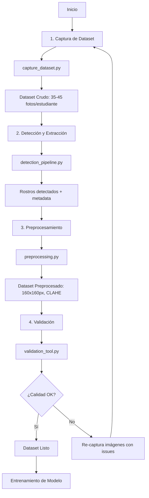

# 🎯 Sistema de Captura y Detección Facial con MTCNN

Sistema completo para capturar, detectar, preprocesar y validar datasets de rostros faciales usando MTCNN (Multi-task Cascaded Convolutional Networks).

## 📋 Tabla de Contenidos

- [Características](#características)
- [Requisitos](#requisitos)
- [Instalación](#instalación)
- [Estructura del Proyecto](#estructura-del-proyecto)
- [Guía de Uso](#guía-de-uso)
- [Explicación de Componentes](#explicación-de-componentes)
- [Flujo de Trabajo Recomendado](#flujo-de-trabajo-recomendado)

---

## ✨ Características

### ✅ Funcionalidades Principales

- **Captura de Dataset**: Interfaz interactiva para capturar 35-45 fotos por estudiante
- **Detección Facial**: Pipeline completo con MTCNN preentrenado
- **Validación en Tiempo Real**: Verificación de calidad (rostro detectado, enfoque, iluminación)
- **Sistema de Nombrado Automático**: Formato `STU001_001.jpg` con timestamps
- **Preprocesamiento Avanzado**: 
  - Redimensionamiento estándar (160x160px)
  - Normalización de píxeles
  - Ecualización de histograma (CLAHE)
  - Filtrado de imágenes borrosas
- **Herramienta de Validación Visual**: Navegador interactivo con métricas de calidad
- **Reportes Técnicos**: Generación automática de estadísticas y análisis

---

## 📦 Requisitos

### Software Necesario

- Python 3.8 o superior
- Webcam (para captura en tiempo real)
- 2GB de espacio en disco (para dataset)

### Librerías Python

```bash
opencv-python==4.8.1.78
mtcnn==0.1.1
numpy==1.24.3
tensorflow==2.13.0
pillow==10.0.0
matplotlib==3.7.2
```

---

## 🚀 Instalación

### Paso 1: Clonar o Descargar Archivos

Crea una carpeta para tu proyecto y coloca todos los archivos:

```bash
mkdir facial-detection-system
cd facial-detection-system
```

### Paso 2: Instalar Dependencias

```bash
pip install -r requirements.txt
```

### Paso 3: Verificar Instalación

```bash
python -c "import cv2; import mtcnn; print('✓ Instalación exitosa')"
```

---

## 📁 Estructura del Proyecto

```
facial-detection-system/
│
├── capture_dataset.py          # Script de captura de dataset
├── detection_pipeline.py       # Pipeline de detección con MTCNN
├── preprocessing.py            # Sistema de preprocesamiento
├── validation_tool.py          # Herramienta de validación visual
├── requirements.txt            # Dependencias del proyecto
├── README.md                   # Esta documentación
│
└── dataset/                    # Directorio del dataset (se crea automáticamente)
    ├── STU001/                 # Carpeta por estudiante
    │   ├── STU001_001_20250106_143022.jpg
    │   ├── STU001_001_20250106_143022_metadata.json
    │   ├── STU001_002_20250106_143025.jpg
    │   └── ...
    ├── STU002/
    └── registry.json           # Registro de capturas
```

---

## 🎮 Guía de Uso

### 1️⃣ Captura de Dataset

**Objetivo**: Capturar 35-45 fotos por estudiante con validación de calidad en tiempo real.

```bash
python capture_dataset.py
```

**Proceso**:

1. Selecciona opción `1` para nuevo estudiante
2. Ingresa ID del estudiante (ej: `STU001`)
3. Define número de fotos objetivo (default: 40)
4. La cámara se abrirá mostrando:
   - Bounding box verde/rojo según calidad
   - 5 landmarks faciales
   - Score de confianza
   - Progreso actual

**Controles**:
- `ESPACIO`: Capturar foto (solo si calidad es OK)
- `Q`: Salir
- `S`: Cambiar de estudiante

**Validaciones Automáticas**:
- ✅ Confianza mínima: 0.95
- ✅ Tamaño mínimo del rostro: 100x100px
- ✅ Iluminación adecuada (brillo entre 50-200)
- ✅ Rostro detectado y enfocado

**Salida**:
```
dataset/STU001/
  ├── STU001_001_20250106_143022.jpg
  ├── STU001_001_20250106_143022_metadata.json  # Contiene: timestamp, confidence, box, keypoints
  ├── STU001_002_20250106_143025.jpg
  └── ...
```

---

### 2️⃣ Pipeline de Detección

**Objetivo**: Detectar múltiples rostros en imágenes con MTCNN configurado.

```bash
python detection_pipeline.py
```

**Opciones Disponibles**:

#### A) Detección en Tiempo Real (Webcam)
```
Opción 1 → Abre webcam
- Detecta rostros en cada frame
- Muestra bounding boxes y landmarks
- Contador de rostros en tiempo real
- Presiona 'Q' para salir
```

#### B) Procesar Lote de Imágenes
```
Opción 2 → Procesamiento batch
- Ingresa directorio de entrada
- Ingresa directorio de salida
- Genera:
  * Imágenes anotadas con detecciones
  * Recortes individuales de cada rostro
  * detection_results.json con metadatos
```

**Ejemplo de uso batch**:
```bash
# Desde el script
Opción: 2
Directorio de entrada: dataset/STU001
Directorio de salida: processed/STU001

# Salida:
processed/STU001/
  ├── annotated_STU001_001.jpg      # Imagen con bounding boxes
  ├── detection_results.json         # Metadatos de detecciones
  └── face_crops/
      ├── STU001_001_face1.jpg      # Recorte del rostro
      └── ...
```

#### C) Procesar Imagen Única
```
Opción 3 → Demo con una imagen
- Muestra detecciones en ventana interactiva
- Útil para pruebas rápidas
```

**Características del Pipeline**:
- 🔍 Detección de múltiples rostros por imagen
- 📊 Extracción de 5 landmarks faciales (ojos, nariz, boca)
- 📦 Extracción de bounding boxes con margen ajustable
- 🔄 Alineación facial basada en landmarks de ojos
- ⚡ Estadísticas de tiempo de procesamiento

---

### 3️⃣ Sistema de Preprocesamiento

**Objetivo**: Estandarizar y mejorar calidad del dataset.

```bash
python preprocessing.py
```

**Opciones Disponibles**:

#### A) Preprocesar Dataset Completo
```
Opción 1 → Procesa toda la estructura de carpetas
Dataset original: dataset/
Dataset preprocesado: dataset_preprocessed/

# Mantiene la estructura:
dataset_preprocessed/
  ├── STU001/
  ├── STU002/
  └── ...
```

#### B) Preprocesar Carpeta Única
```
Opción 2 → Procesa un solo directorio
Entrada: dataset/STU001
Salida: processed/STU001
```

#### C) Demo con Imagen Única
```
Opción 3 → Comparación visual antes/después
- Muestra imagen original y preprocesada lado a lado
```

#### D) Verificar Calidad
```
Opción 4 → Análisis de nitidez
- Escanea todas las imágenes
- Detecta imágenes borrosas (score Laplaciano < 100)
- Genera reporte de calidad
```

**Pipeline de Preprocesamiento**:

1. **Redimensionamiento Estándar** (160x160px)
   ```python
   # Asegura uniformidad en el dataset
   target_size = (160, 160)
   ```

2. **CLAHE (Contrast Limited Adaptive Histogram Equalization)**
   ```python
   # Mejora contraste localmente
   # Ideal para condiciones de iluminación variable
   ```

3. **Normalización de Píxeles** [0, 1]
   ```python
   # Opcional: útil para entrenamiento de modelos
   normalized = image / 255.0
   ```

4. **Filtrado de Calidad**
   - Detección de desenfoque (Laplaciano)
   - Validación de brillo
   - Verificación de contraste

**Ejemplo de Uso**:
```python
# Preprocesar todo el dataset
preprocessor = FacePreprocessor(target_size=(160, 160))
preprocessor.create_preprocessed_dataset('dataset/', 'dataset_preprocessed/')

# Resultado:
✓ STU001: 38/40 imágenes procesadas (2 rechazadas por desenfoque)
✓ STU002: 42/45 imágenes procesadas (3 rechazadas por desenfoque)
```

---

### 4️⃣ Herramienta de Validación Visual

**Objetivo**: Inspeccionar visualmente el dataset y generar reportes de calidad.

```bash
python validation_tool.py
```

**Opciones Disponibles**:

#### A) Navegador Visual Interactivo
```
Opción 1 → Navegar dataset imagen por imagen
```

**Controles del Navegador**:
- `N` o `→`: Siguiente imagen
- `P` o `←`: Imagen anterior  
- `S`: Saltar al siguiente estudiante
- `Q`: Salir

**Información Mostrada**:
```
┌─────────────────────────────────────┐
│ [Imagen con bounding box y landmarks]│
│                                     │
│ Color del box:                      │
│   🟢 Verde: Confianza ≥ 0.99        │
│   🟡 Amarillo: Confianza ≥ 0.95     │
│   🔴 Rojo: Confianza < 0.95         │
└─────────────────────────────────────┘
┌─────────────────────────────────────┐
│ Panel de Información:               │
│ • Estudiante: STU001                │
│ • Imagen: 15/40                     │
│ • Score Calidad: 85.0/100           │
│ • Brillo: 127.3                     │
│ • Nitidez: 245.7                    │
│ • Contraste: 52.1                   │
│ • Issues: [Ninguno]                 │
└─────────────────────────────────────┘
```

#### B) Generar Reporte de Validación
```
Opción 2 → Análisis automático completo
```

**Genera**: `validation_report.json`

**Contenido del Reporte**:
```json
{
  "timestamp": "2025-01-06T14:30:22",
  "dataset_dir": "dataset/",
  "global_stats": {
    "total_students": 10,
    "total_images": 420,
    "issues_found": 35
  },
  "students": {
    "STU001": {
      "total_images": 40,
      "avg_quality_score": 87.5,
      "avg_confidence": 0.976,
      "images_with_issues": [
        {
          "filename": "STU001_023.jpg",
          "issues": ["Imagen borrosa"],
          "quality_score": 55.0
        }
      ]
    }
  }
}
```

#### C) Revisar Estudiante Específico
```
Opción 3 → Validación de un solo estudiante
ID del estudiante: STU001
```

**Métricas de Calidad Evaluadas**:

| Métrica | Rango Óptimo | Penalización |
|---------|--------------|--------------|
| **Brillo** | 50-200 | -20 puntos |
| **Contraste** | ≥30 | -15 puntos |
| **Nitidez** | ≥100 | -30 puntos |
| **Saturación** | ≥20 | -10 puntos |

**Score Final**: 0-100 (100 = calidad perfecta)

---

## 🔍 Explicación de Componentes

### 📸 1. capture_dataset.py

**Clase Principal**: `DatasetCapture`

**Métodos Clave**:

```python
def validate_quality(face_data, frame):
    """
    Valida en tiempo real:
    - Confianza de detección ≥ 0.95
    - Tamaño mínimo del rostro
    - Iluminación adecuada (brillo promedio)
    
    Returns: (is_valid, message)
    """
```

```python
def capture_for_student(student_id, target_photos=40):
    """
    Loop principal de captura:
    1. Detecta rostro con MTCNN (cada 3 frames)
    2. Valida calidad
    3. Espera tecla ESPACIO para capturar
    4. Guarda imagen + metadata JSON
    5. Actualiza registry.json
    """
```

**Metadata Guardada**:
```json
{
  "timestamp": "20250106_143022_123456",
  "confidence": 0.9876,
  "box": [x, y, width, height],
  "keypoints": {
    "left_eye": [x, y],
    "right_eye": [x, y],
    "nose": [x, y],
    "mouth_left": [x, y],
    "mouth_right": [x, y]
  },
  "resolution": [height, width]
}
```

---

### 🔎 2. detection_pipeline.py

**Clase Principal**: `FaceDetectionPipeline`

**Configuración de MTCNN**:
```python
detector = MTCNN(
    min_face_size=40,      # Tamaño mínimo de rostro a detectar
    scale_factor=0.709,    # Factor de escalado de pirámide
    steps_threshold=[0.6, 0.7, 0.7]  # Umbrales de las 3 etapas
)
```

**Métodos Importantes**:

```python
def detect_faces(image):
    """
    Detecta rostros y actualiza estadísticas:
    - Tiempo de procesamiento
    - Número de rostros detectados
    - Rostros con alta confianza
    
    Returns: Lista de detecciones filtradas por confianza
    """
```

```python
def extract_face_roi(image, box, margin=20):
    """
    Extrae región del rostro con margen:
    - Previene recortes en los bordes
    - Margen configurable
    - Maneja límites de imagen
    
    Returns: ROI del rostro
    """
```

```python
def align_face(image, keypoints):
    """
    Alinea rostro basándose en posición de ojos:
    1. Calcula ángulo entre ojos
    2. Genera matriz de rotación
    3. Aplica transformación afín
    
    Returns: Rostro alineado horizontalmente
    """
```

**Visualización**:
- Bounding boxes con código de colores
- Landmarks con etiquetas (LE, RE, N, ML, MR)
- Scores de confianza
- Numeración de rostros

---

### ⚙️ 3. preprocessing.py

**Clase Principal**: `FacePreprocessor`

**Pipeline de Procesamiento**:

```python
def preprocess_pipeline(image):
    """
    Flujo completo:
    1. Redimensionar → 160x160px
    2. CLAHE → Mejorar contraste
    3. Normalizar → [0, 1] (opcional)
    
    Returns: Imagen preprocesada
    """
```

**Detección de Desenfoque**:
```python
def detect_blur(image, threshold=100):
    """
    Usa operador Laplaciano:
    - Calcula varianza del Laplaciano
    - Threshold típico: 100
    - < 100 = borrosa, ≥ 100 = nítida
    
    Returns: (is_sharp, variance_score)
    """
```

**CLAHE - Explicación**:
```
CLAHE (Contrast Limited Adaptive Histogram Equalization)
├── Divide imagen en tiles (8x8)
├── Aplica ecualización local en cada tile
├── Limita contraste para evitar amplificación de ruido
└── Interpola bordes entre tiles

Beneficio: Mejora contraste sin sobre-saturar
Ideal para: Iluminación no uniforme
```

**Aumentación de Datos** (opcional):
```python
augmentation_types = [
    'brightness',  # Ajuste de brillo ±30%
    'flip',        # Volteo horizontal
    'rotation',    # Rotación ±15°
    'noise'        # Ruido gaussiano
]
```

---

### ✅ 4. validation_tool.py

**Clase Principal**: `ValidationTool`

**Análisis de Calidad**:

```python
def analyze_quality_metrics(image):
    """
    Calcula métricas completas:
    
    1. Brillo (mean de canal gris)
       - < 50: Muy oscuro
       - > 200: Muy brillante
       - Óptimo: 80-180
    
    2. Contraste (std de canal gris)
       - < 30: Bajo contraste
       - Óptimo: > 40
    
    3. Nitidez (varianza Laplaciano)
       - < 100: Borrosa
       - Óptimo: > 150
    
    4. Saturación (mean de canal S en HSV)
       - < 20: Imagen desaturada
       - Óptimo: > 30
    
    Returns: dict con todas las métricas + score final
    """
```

**Cálculo de Score de Calidad**:
```
Score Inicial: 100 puntos

Penalizaciones:
- Brillo fuera de rango:  -20 puntos
- Bajo contraste:         -15 puntos
- Imagen borrosa:         -30 puntos
- Baja saturación:        -10 puntos

Score Final: max(0, 100 - penalizaciones)
```

**Navegador Interactivo**:
- Muestra imagen con anotaciones de MTCNN
- Panel de información con métricas en tiempo real
- Lista de issues detectados
- Navegación fluida con teclado

---

## 📊 Flujo de Trabajo Recomendado

### Workflow Completo del Proyecto:



### Paso a Paso Detallado:

#### **FASE 1: Captura** (Días 1-2)
```bash
# 1. Capturar estudiantes
python capture_dataset.py

# Para 10 estudiantes × 40 fotos = 400 imágenes
# Tiempo estimado: 15-20 min por estudiante
```

#### **FASE 2: Detección** (Día 3)
```bash
# 2. Procesar dataset completo
python detection_pipeline.py
# Opción 2 → Procesar batch
# Input: dataset/
# Output: processed/

# Verifica que todos los rostros se detecten correctamente
```

#### **FASE 3: Preprocesamiento** (Día 3)
```bash
# 3. Preprocesar imágenes
python preprocessing.py
# Opción 1 → Preprocesar dataset completo
# Input: dataset/
# Output: dataset_preprocessed/

# Filtra imágenes borrosas automáticamente
```

#### **FASE 4: Validación** (Día 4)
```bash
# 4. Validar calidad
python validation_tool.py
# Opción 2 → Generar reporte

# 5. Revisar visualmente casos con issues
# Opción 1 → Navegar dataset

# 6. Re-capturar imágenes problemáticas si es necesario
```

---

## 📈 Métricas y Entregables

### ✅ Entregables del Proyecto:

1. **📁 Dataset Parcial Capturado**
   - Mínimo 10 estudiantes × 40 fotos = 400 imágenes
   - Formato: `STU001_001.jpg` con metadata JSON

2. **💻 Scripts Funcionales**
   - ✅ `capture_dataset.py`
   - ✅ `detection_pipeline.py`
   - ✅ `preprocessing.py`
   - ✅ `validation_tool.py`

3. **📊 Reporte Técnico**
   ```
   validation_report.json:
   - Tasa de detección exitosa (%)
   - Tiempo promedio de procesamiento por imagen
   - Análisis de casos fallidos (iluminación, pose, distancia)
   ```

4. **📸 Estadísticas de Calidad**
   - Score promedio de confianza
   - Distribución de scores de calidad
   - Identificación de mejores/peores capturas

---

## 🎯 Tips y Mejores Prácticas

### Para Captura:
1. **Iluminación**: Usar luz natural o luz frontal difusa
2. **Fondo**: Preferir fondos uniformes y neutros
3. **Distancia**: Rostro debe ocupar 40-60% del frame
4. **Variación**: Capturar diferentes:
   - Ángulos de cabeza (±15°)
   - Expresiones faciales
   - Uso de accesorios (lentes, opcional)

### Para Preprocesamiento:
1. **Threshold de desenfoque**: Ajustar si es muy estricto/permisivo
2. **Tamaño objetivo**: 160x160px es estándar para modelos como FaceNet
3. **CLAHE**: Esencial para dataset con iluminación variable

### Para Validación:
1. **Revisar primero el reporte JSON**: Identifica estudiantes problemáticos
2. **Navegar visualmente**: Verifica casos con score < 70
3. **Re-captura selectiva**: Mejor re-capturar que forzar imágenes malas

---

## 🐛 Troubleshooting

### Problema: "No se detecta la webcam"
```python
# Probar diferentes índices
cap = cv2.VideoCapture(0)  # Cambiar 0 por 1, 2, etc.
```

### Problema: "MTCNN muy lento"
```python
# Reducir resolución de entrada
cap.set(cv2.CAP_PROP_FRAME_WIDTH, 640)
cap.set(cv2.CAP_PROP_FRAME_HEIGHT, 480)

# Procesar cada N frames
if frame_count % 3 == 0:
    faces = detector.detect_faces(frame)
```

### Problema: "Muchas imágenes rechazadas por desenfoque"
```python
# Ajustar threshold en preprocessing.py
threshold = 100  # Reducir a 80 si es muy estricto
```

---

## 📚 Referencias

- **MTCNN Paper**: Zhang et al. "Joint Face Detection and Alignment using Multi-task Cascaded Convolutional Networks" (2016)
- **OpenCV Docs**: https://docs.opencv.org/
- **TensorFlow**: https://www.tensorflow.org/

---

## 👨‍💻 Autor y Soporte

Para dudas o problemas con el sistema, verificar:
1. Versiones de librerías en `requirements.txt`
2. Permisos de cámara en tu sistema operativo
3. Espacio en disco suficiente

**¡Éxito con tu proyecto de detección facial! 🚀**